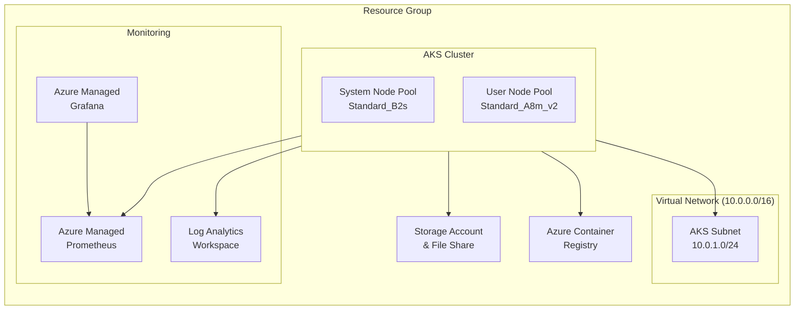
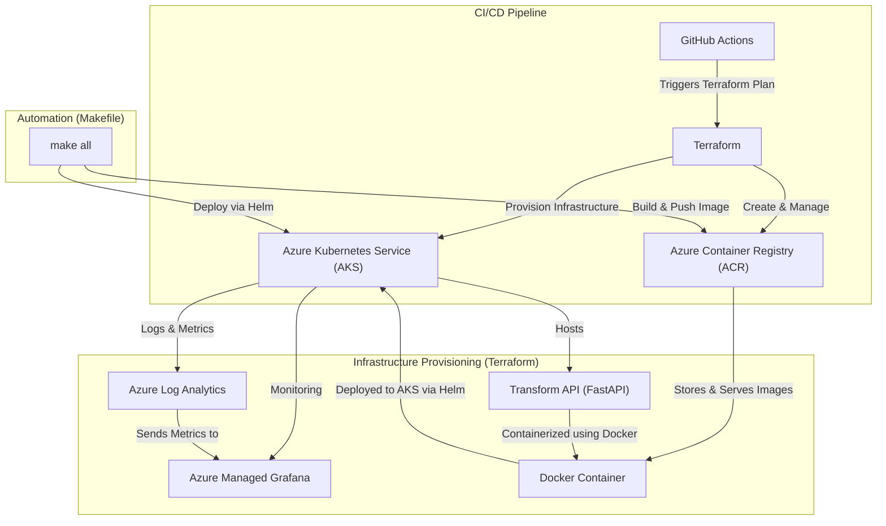

# **Project Overview**

## **Introduction**
This project is a **cloud-native application** deployed on **Azure Kubernetes Service (AKS)** using **Terraform** for infrastructure provisioning, **Helm** for Kubernetes deployment, and **FastAPI** for the `transformApi` service. Deployment and infrastructure management are fully automated via **GitHub Actions**.

Additionally, **Azure Managed Grafana** is used for centralized **monitoring and observability**.

---

## **Infrastructure Overview (Terraform)**
The **Terraform** configuration provisions the cloud infrastructure on **Azure**.

### **State Management**
Terraform state is stored in **Azure Blob Storage**:
- **Resource Group**: `rg-terraform-github-actions-state`
- **Storage Account**: `storagemarcelf`
- **Container**: `tfstate`
- **State File**: `terraform-big-main.tfstate`

### **Terraform Modules**
| **Module**          | **Purpose** |
|---------------------|------------|
| **Resource Group**  | Creates a logical grouping for all resources |
| **Virtual Network** | Provides network connectivity and subnets |
| **AKS Cluster**     | Deploys an Azure Kubernetes Service (AKS) cluster |
| **Log Analytics**   | Configures monitoring and logging for AKS |
| **Storage Account** | Creates storage for application data |
| **Azure Container Registry (ACR)** | Manages container images for deployment |
| **Azure Managed Grafana** | Provides centralized metrics and observability |

---

## **Service Overview: Transform API**
The **Transform API** is a **FastAPI-based chatbot API** powered by **Hugging Face’s DialoGPT model**. It is containerized with **Docker** and deployed on **AKS**.

### **Endpoints**
| Method | Path       | Description |
|--------|-----------|-------------|
| **GET**  | `/`       | Root      |
| **GET**  | `/health` | Service status |
| **POST** | `/chat`   | Generates a response from DialoGPT |

### **How It Works**
1. **Model Initialization**: Loads **DialoGPT-small** at startup.
2. **Chat Processing**: Tokenizes user input and generates responses.

---

## **Monitoring & Metrics**
This project leverages **Azure Managed Grafana** for monitoring. The AKS cluster and application logs are collected via **Azure Log Analytics**, and **Grafana dashboards** provide **real-time observability**.

---

## **Automation with Makefile**
The **Makefile** automates **build, push, and deployment** tasks.

### **Makefile Commands**
```bash
make build       # Build the Docker image
make tag         # Tag the image for ACR
make push        # Push the image to Azure Container Registry (ACR)
make deploy      # Deploy to AKS using Helm
make destroy     # Remove deployment from AKS
make all         # Build, push, and deploy in one step
```

### **Example Deployment**
```bash
make all
```

---

## **Helm Deployment**
The **Helm chart** deploys the application to **AKS**.

### **Deploy with Helm**
```bash
helm upgrade --install tgi ./helm \
  --namespace default \
  --set storageAccountName="$STORAGE_ACCOUNT_NAME" \
  --set storageAccountKey="$STORAGE_ACCOUNT_KEY"
```

---

## **CI/CD Pipeline (GitHub Actions)**
A **GitHub Actions** workflow (`tf-plan-apply.yml`) automates:
- **Terraform Plan & Apply**
- **Docker Build & Push**
- **Helm Deployment to AKS**

### **Terraform Workflow Overview**
- Runs on **push** and **pull requests** to `main`
- Uses **OIDC authentication** for secure Azure access
- Executes `terraform plan` and posts results to PRs
- If on `main`, applies changes automatically

---

## **Infrastructure Diagram**


---

## **Deployment Flowchart**


---

## **Full Deployment Guide**
### **Step 1: Initialize Terraform**
```bash
cd terraform
terraform init
terraform apply -auto-approve
```

### **Step 2: Deploy the Application**
```bash
make all
```

## **Step 3: Verify Functionality**
After ensuring the service is running, follow these steps to verify that the API is functional.

### **1. Get the External IP**
Run the following command to get the external IP of the `tgi-service` service:
```bash
kubectl get svc
```
Look for the **EXTERNAL-IP** under the `tgi-service` service.

### **2. Open API Documentation**
Once you have the external IP, open your browser and navigate to:
```
http://<EXTERNAL-IP>/docs
```
This will open the **FastAPI Swagger UI**, allowing you to test the API.

### **3. Check Service Health**
Run the following command to check if the service is healthy:
```bash
curl http://<EXTERNAL-IP>/health
```
Expected Response:
```json
{"status": "healthy"}
```

### **4. Test Chatbot API**
To verify that the chatbot is working, send a test request:
```bash
curl -X 'POST' \
  'http://<EXTERNAL-IP>/chat' \
  -H 'accept: application/json' \
  -H 'Content-Type: application/json' \
  -d '{
  "inputs": "Hello, who are you?"
}'
```
Expected Response:
```json
{
  "response": "So they don't have to pay a thing then?"
}
```

---

## **Conclusion**
This project provides a **scalable, cloud-native architecture**, integrating **FastAPI, Hugging Face’s DialoGPT, Kubernetes, and Terraform**. 

With **Makefile automation and CI/CD pipelines**, deployment is **seamless and efficient**, while **Azure Managed Grafana** ensures **real-time observability**.
